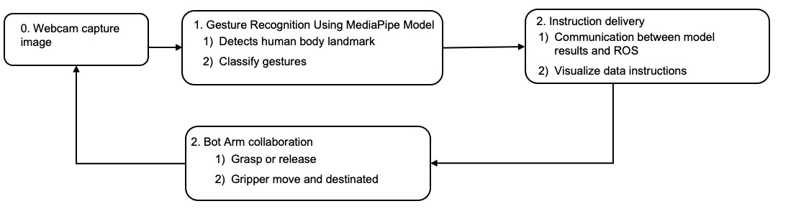
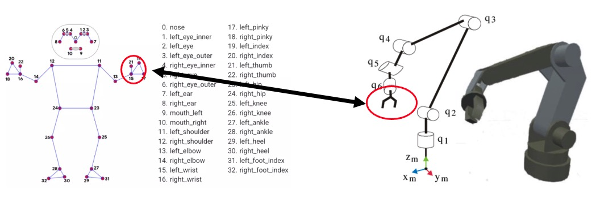
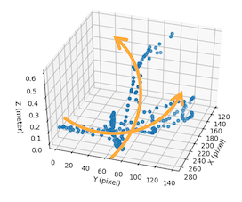
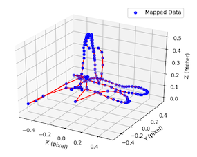
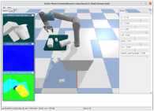

# Interaction between Human Body Pose and Robot Arm Using Deep Learning and Digital Twin

This project develops an intuitive human-robot interaction (HRI) system. By leveraging **Deep Learning (MediaPipe)** and **Digital Twin (PyBullet)** technologies, it maps human arm gestures captured via a depth camera to a physical robot arm in real-time. This replaces traditional keyboard-based control with natural, vision-based interaction.

## Team & Supervision
* **Developers:** Su Chih-Yu, Zhang Yi-Lun
* **Advisor:** Prof. Jenn-Jier James Lien

---

## System Architecture
The system follows a closed-loop control flow to ensure precision and safety:



1. **Vision Input**: An **Intel® RealSense™ D435** captures RGB-D data.
2. **Pose Processing**: **MediaPipe** extracts 3D landmarks (x, y, z) of the user's arm joints.
3. **Signal Filtering**: A **Kalman Filter** is applied to eliminate jitter caused by involuntary human movement or sensor noise.
4. **Digital Twin Sync**: The filtered coordinates are sent to **PyBullet** for inverse kinematics calculation and motion path validation.
5. **Physical Execution**: Validated commands are transmitted via **ROS** to the **TM Robot**.

---

## Key Technical Modules

### 1. Vision & Depth Sensing (Intel® RealSense™)
The system utilizes infrared (IR) laser and RGB sensors to capture 3D spatial mapping ($X, Y, Z$). This allows the system to distinguish the user's distance and accurately map movements to the robot's coordinate system.

### 2. Gesture Estimation (MediaPipe)
The MediaPipe Pose model identifies key landmarks. We specifically focus on the **Shoulder, Elbow, and Wrist** joints to create a 3D mapping for the robot arm.



### 3. Motion Smoothing (Kalman Filter)
To counteract involuntary tremors and sensor noise, a discrete Kalman Filter is implemented to smooth the trajectory. The state update is governed by:

$$x_k = K_k \cdot z_k + (1 - K_k) \cdot x_{k-1}$$

**Where:**
* $x_k$: Current estimated position (Smooth output)
* $K_k$: Kalman Gain (Weight of the current measurement)
* $z_k$: Current measured position from sensors (Raw input)
* $x_{k-1}$: Previous estimated position


| Origin | Mapped & Filter |
| -------- | -------- | 
|  |  |

### 4. Digital Twin & Safety (PyBullet)
The **UR5/TM5** model in PyBullet acts as a safety buffer. It verifies movement within the robot's reach to prevent self-collision or singularities before physical execution.



---

## Applications & Results
* **Real-time Object Grabbing**: Guide the robot arm to pick up items via natural gestures.
* **Electric Wire Maze Game**: A high-precision test demonstrating low latency and fine-grained control.
* **Interactive UI**: A custom-built interface for calibration, data visualization, and mode switching (Grip, Free, Start Arm).


---

## TODO
- [ ] **Enhanced Autonomy**: Implementing complex macro triggers via specific finger patterns.
- [ ] **Improved Latency**: Optimizing the ROS-Python bridge for higher frame rates.
- [ ] **Multi-User Support**: Recognizing and prioritizing gestures from multiple operators.

---

## Getting Started

### Prerequisites
* Ubuntu 20.04 / Windows 10
* Python 3.8+
* ROS Noetic (for physical robot)
* Libraries: `mediapipe`, `pybullet`, `pyrealsense2`, `numpy`, `opencv-python`

### Installation
```bash
pip install mediapipe pybullet numpy opencv-python pyrealsense2
```

### Reference

[TechmanRobot Driver - GitHub](https://github.com/TechmanRobotInc)

[Intel® RealSense™ Library - Github](https://github.com/realsenseai/librealsense)

[Google Mediapipe](https://ai.google.dev/edge/mediapipe/solutions/guide?hl=zh-tw)